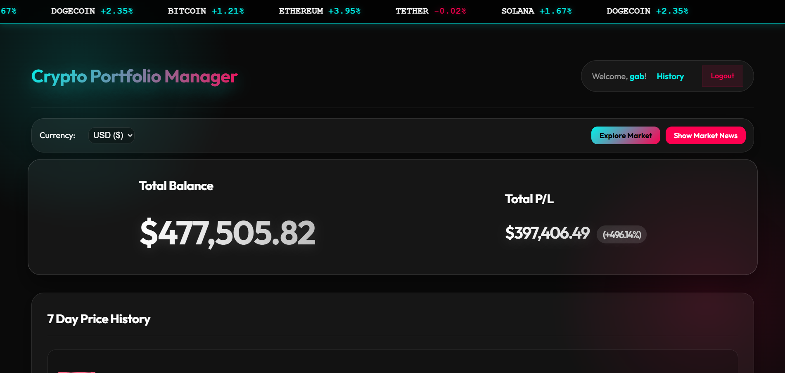
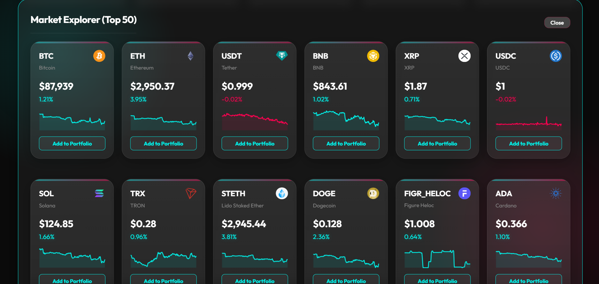
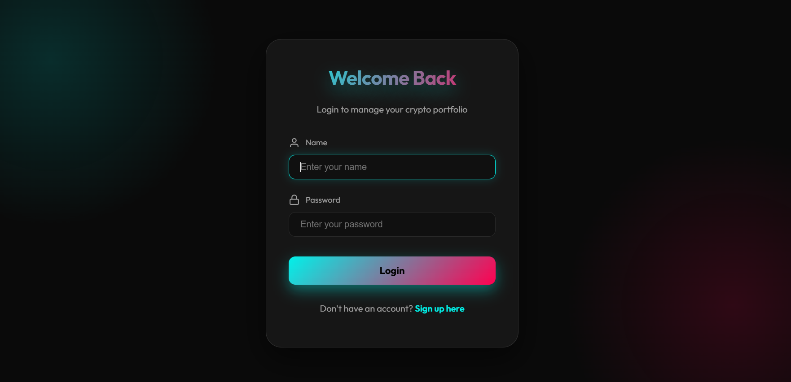

# 🚀 Crypto Portfolio Manager

A premium, real-time cryptocurrency portfolio tracker built with **Flask**, **Chart.js**, and the **CoinGecko API**. Featuring glassmorphism design, interactive visualizations, and secure trading simulations.

## 📸 Application Showcase

| Main Dashboard | Market Explorer | Auth UI Design |
| :---: | :---: | :---: |
|  |  |  |

## ✨ Features

- **Real-Time Dashboard**: Automatic price updates every minute with persistent P/L tracking.
* **Interactive Visualization**: Isolated 7-day sparklines and portfolio distribution charts.
* **Trading Simulator**: Execute BUY/SELL orders with weighted average buy price calculation.
- **Market Explorer**: Browse Top 50 market coins with live mini-charts.
- **Global Settings**: multi-currency support (USD, EUR, GBP, INR, JPY) and localized formatting.
- **News Feed**: Integrated live crypto news to stay ahead of the market.
* **Price Alerts & Notifications**: Browser-based alerts for price movements.
- **Export**: Download your transaction history as CSV.

## 🛠️ Technology Stack

- **Backend**: Python, Flask, SQLite
- **Frontend**: Vanilla JS, CSS3 (Glassmorphism), HTML5
* **APIs**: CoinGecko (Market Data), CryptoNews (News Feed)
* **Libraries**: Chart.js (Interactive Graphs), Flask-Login (Authentication)

## 📦 Installation & Setup

1. **Clone the repository**:
   ```bash
   git clone https://github.com/gab-8323/Crypto-Portfolio-Manager.git
   cd crypto-portfolio-manager
   ```

2. **Set up virtual environment**:
   ```bash
   python -m venv venv
   source venv/bin/activate  # Windows: venv\Scripts\activate
   ```

3. **Install dependencies**:
   ```bash
   pip install -r requirements.txt
   ```

4. **Run the app**:
   ```bash
   python app.py
   ```

## 🚀 Deployment (Render)

This project is configured for easy deployment on **Render**:
1. Connect your GitHub repo to Render.
2. Use **Python** as the environment.
3. Build Command: `pip install -r requirements.txt`
4. Start Command: `gunicorn app:app`
5. **Disk Store**: (Optional but Recommended) Mount a disk to `/data` and set the Environment Variable `DATABASE_URL` to `/data/portfolio.db` for persistent storage.

## 📄 License

This project is licensed under the **MIT License** - see the [LICENSE](LICENSE) file for details.

---
*Built with ❤️ by Vignesh Palika.*
